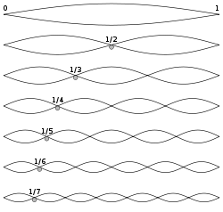
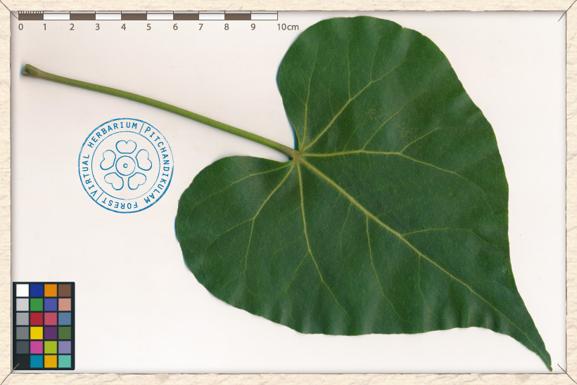


## Technical
### What is a raga?
Although a raga is similar to a melodic mode in Western music (or a scale starting on a particular note), South Indian ragas also have the following characteristics:
- One note order when the phrase is ascending (arohana)
- A separate note order when the notes are descending (avarohana)

These two can be the same. For example, Shankabharanam, the raga that is closest to the Western major scale, would have in the shruti of C:

 raga   | arohana (&uarr;) |  avarohana  (&darr;) |  
 ------- | ------- | ------ 
Shankabharanam (in C) | C D E F G A B C | C B A G F E D C 
(swara names) | S R G M P D N S | S N D P M G R S

It does not mean the musician is forced to go from one note to the next note - an experienced musician can jump around they wish. 

However, the pitch and order of the notes are just one element. Just as important are these other characteristics:
- Particular notes in the raga are understood to have 'weight' or 'gravity' - phrases can frequently begin or end on this note.
- The neighbouring notes are 'pulled' towards these central notes, meaning that the pitches of these notes are not fixed. 
- Certain notes in a raga are sung with one or more **gamakam** (ornaments, or 'shaking' a note), and others are not. 
- Each raga has signature phrases which are considered to be integral to its essence. These phrases have come down to us from the great composers.
- Due to all these complexities named above, improvisation takes vast experience and knowledge, and is taught relatively late in the learning process. Traditionally, it is said that a student should know many compositions in a particular raga before attempting basic improvisation. At the very least, most ragas have at least one **varnam** (composed study), in which many of these elements above will be featured.

### The Melakarta system
The many thousands of ragas are organised into a classification system called the Melakarta system. It is respected by many scholars as the most complete classification system in the world: 72 modes, each belonging to one of 12 parent families (chakras). 



### Parent ragas (sampurna)
Each of these 72 modes differs in its swaras, or notes, and is a raga in its own right. They are known as 'full' or <em>sampurna ragas</em>, and have the following characteristics:

- Each raga has all seven *swaras* (notes)
- The arohana (the order going up) is S R G M P D N S
- The avarohana (the order going down) is S N D P M G R S



### Child ragas (janya)
We can think of each of these 72 ragas as being the parent raga, and originating from them are many hundreds of child, or <em>[janya ragas](https://en.wikipedia.org/wiki/List_of_Janya_ragas){:target=>'_blank'}</em>.

Janya ragas have the following characteristics:
- Each raga can use anywhere between three and all seven notes.
- The arohana (the order of the notes going up) can skip over notes, or turn back and repeat them.
- The avarohana (the order of notes going down) can skip over notes, or turn back and repeat them. 

One of the janya ragas of Shankarabharanam is the pentatonic Hamsadhwani, a wonderful raga for meditation and calming. It is also an easy raga for beginners, as the arohana and avarohana are straight up and straight down, and there are only five notes. You can listen to its signature shapes at the [Raga Surabhi](https://www.ragasurabhi.com/carnatic-music-mp3/raga-hamsadwani-signature.mp3) site.

 raga   | arohana (&uarr;) |  avarohana  (&darr;) |  
 ------- | ------- | ------ 
Hamsadhwani | S R G P N S | S N P G R S



There are many hundreds of books and articles written about the raga system. I heartily recommend looking at the [Carnatic Student](https://www.carnaticstudent.org){:target=>'_blank'} website as a starting point.

## Spiritual

<figure class="half">
    
    
    <figcaption>Harmonic ratios and perfection in nature</figcaption>
</figure>

There are limitless examples of perfection in nature: whether the colours of the sky at dawn or the shape of a single leaf. Like both these forms, each raga is a series of mathematical ratios, and one raga reflects one example of perfect natural beauty. The job of the musician is to first empty him or herself, so that, in a performance, they can fill themselves up with this single example of perfection such that it flows out of them into the audience. In this way, this single example of natural perfection fills the room so that everyone present can feel and taste its divine beauty.

